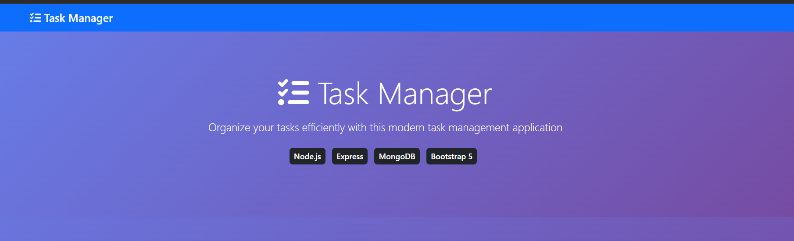

# 📝 Task Manager Application

A full-stack task management application built with Node.js, Express, MongoDB, and vanilla JavaScript.


## 🚀 Live Demo

**[View Live Demo](https://task-manager-app-aki3.onrender.com/)** 👈 Try it out!

## ✨ Features

- ✅ Create, Read, Update, Delete (CRUD) tasks
- ✅ Set task priorities (Low, Medium, High)
- ✅ Mark tasks as complete/incomplete
- ✅ Responsive design with Bootstrap 5
- ✅ Real-time updates
- ✅ MongoDB Atlas cloud database
- ✅ RESTful API architecture

## 🛠️ Tech Stack

**Frontend:**
- HTML5, CSS3, JavaScript
- Bootstrap 5
- jQuery
- Font Awesome

**Backend:**
- Node.js
- Express.js
- MongoDB with Mongoose
- RESTful API

## 📸 Screenshots

### Main Interface


### Task Creation


## 🚀 Getting Started

### Prerequisites

- Node.js (v14 or higher)
- MongoDB Atlas account
- npm or yarn

### Installation

1. **Clone the repository**
   ```bash
   git clone https://github.com/YOUR_USERNAME/task-manager-app.git

   cd task-manager-app
